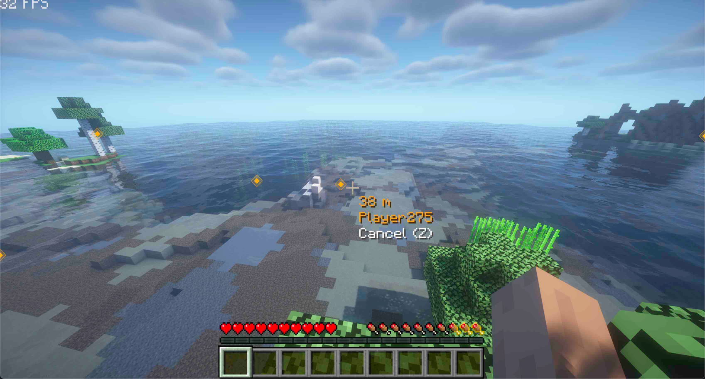
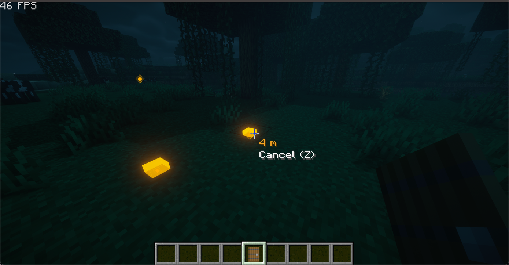

<p align="center">
     
</p>

<h1 align="center">PingSystem</h1>

Ping System for Minecraft. Make MC Apex Again!

## Ping System

Default hotkey: `c`

Send signal to your team for communication.

Press hotkey again on the Ping Point to cancel it.

## Images

A ping from teammate:



Pings at night:



## Dependencies

malilib: [https://www.curseforge.com/minecraft/mc-mods/malilib](https://www.curseforge.com/minecraft/mc-mods/malilib)


## Build

- use jdk-17 (due to Minecraft 1.19.2 Fabric)
  - e.g., `"java.import.gradle.java.home": "/opt/homebrew/opt/openjdk@17"` in your vscode user settings Json
```bash
export JAVA_HOME=/opt/homebrew/opt/openjdk@17 
# build
./gradlew build
# to show the .jar mod file
ls -la build/libs
# run
./gradlew runClient
```


## Todo

- [ ] get current key for info
- [ ] confirm ping of teammate; team system
- [ ] fix NaN when looking up or down
- [ ] (hard) ping entity
- [ ] (hard) automatic pathfinding
- [ ] (hard-compatibility) show on minimap
- [ ] (hard) support forge
- [x] config for mod with mod menu
- [x] support 1.19.2
