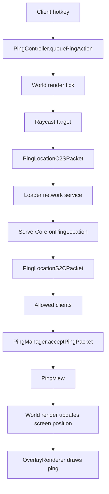

# Architecture

Sophisticated Ping is structured as a Gradle multi-project mod. The design goal is to keep Minecraft gameplay behavior in `common` and isolate Fabric/Forge/NeoForge-specific code in loader modules.

## Module Responsibilities

### `common`

`common` owns the mod's behavior:

- client lifecycle orchestration;
- server lifecycle orchestration;
- ping creation and relay rules;
- ping data model;
- packet model and explicit buffer encoding;
- client/server config objects;
- render calculations and overlay drawing;
- shared resources and localization keys;
- unit tests for packet and common logic.

Important entry classes:

- `app.jyu.common.CommonClient`
- `app.jyu.common.CommonServer`
- `app.jyu.common.Global`

Important subsystems:

```text
common/core/        ping controller, ping manager, ping view, server relay core
common/network/     IPacket and explicit packet records
common/render/      world projection, GUI overlay, draw helpers
common/config/      JSON-backed client/server configs
common/math/        raycast and world-to-screen math
common/platform/    ServiceLoader interfaces for loader adapters
common/resource/    language/resource helpers and reload listener
common/screen/      Ping Wheel-style settings screen
```

### `fabric`

Fabric owns Fabric-only entrypoints and hooks:

- `FabricMain` initializes common server code and registers C2S receivers.
- `FabricClient` initializes common client code and registers S2C receivers/reload listeners.
- `event/` defines custom callbacks used by mixins.
- `mixin/` captures render hooks from Minecraft client classes.
- `platform/` implements common service interfaces for Fabric.
- `integration/ModMenuIntegration` opens the shared settings screen from Mod Menu.

### `forge`

Forge owns Forge-only entrypoints and hooks:

- `ForgeMain` initializes common server code, registers sound/key services, and wires network channels.
- `ForgeClient` initializes common client code and client-only integrations.
- `platform/` implements common service interfaces for Forge.

Forge networking uses `EventNetworkChannel` for the baseline branch.

### `neoforge`

NeoForge is not part of the `1.19.2` baseline module list. Newer generated branches declare `neoforge` in `ci/version-matrix.yml` and apply version-specific build/settings overrides. The NeoForge adapter must provide the same service interfaces as Fabric/Forge and register modern custom payloads without reusing C2S/S2C IDs.

## ServiceLoader Boundary

The common module must not depend directly on Fabric/Forge/NeoForge APIs. Instead it calls interfaces in `app.jyu.common.platform`:

- `IPlatformClientEventService`
- `IPlatformContextService`
- `IPlatformNetworkService`
- `IPlatformServerEventService`
- `IPlatformSoundService`

Each loader module contributes service files under:

```text
META-INF/services/app.jyu.common.platform.<InterfaceName>
```

This is the core multi-loader abstraction. When adding a common feature that needs loader-specific behavior, prefer adding a minimal method to a platform interface and implementing it in each loader module.

## Client Lifecycle

Client initialization flow:

```text
loader client entrypoint
  -> CommonClient.onInit()
    -> load ClientConfig
    -> register tick/join/leave/world-render/gui-render callbacks
    -> register ping/settings keybinds
    -> migrate legacy key mappings
```

Per tick:

```text
CommonClient.onTickStart()
  -> update Minecraft instance reference
  -> update current dimension
  -> run legacy migration tick hook
  -> consume ping hotkey and queue ping
  -> consume settings hotkey and open SettingsScreen
```

Per world-render callback:

```text
CommonClient.onRenderWorld(ctx)
  -> PingManager.updatePings(ctx)
  -> PingController.pollPingAction(ctx.tickDelta)
```

Per GUI-render callback:

```text
CommonClient.onRenderGUI(poseStack, tickDelta)
  -> OverlayRenderer.draw(poseStack, tickDelta)
```

## Server Lifecycle

Server initialization flow:

```text
loader main entrypoint
  -> CommonServer.onInit()
    -> register sound events
    -> load ServerConfig
    -> detect optional mods
    -> initialize ServerCore
    -> register player logout callback
```

Server packet flow:

```text
loader network receiver
  -> CommonServer.onPingLocationPacket(...)
    -> ServerCore.onPingLocation(...)
      -> validate packet
      -> rate-limit sender
      -> enforce channel/default-channel policy
      -> optionally hide player entity tracking
      -> relay S2C packet to allowed recipients
```

## Data Flow



## Design Rules

- Keep common code loader-agnostic.
- Prefer explicit packet encoding over Java object serialization.
- Keep C2S and S2C packet IDs direction-specific.
- Keep client-only Minecraft classes out of server-only code paths.
- Put version-specific API differences in `ci/version-overrides/<version>/`, not manual edits on generated branches.
- Do not reintroduce the old `PingPoint`, `RenderHandler`, or `ModConfig` architecture.

